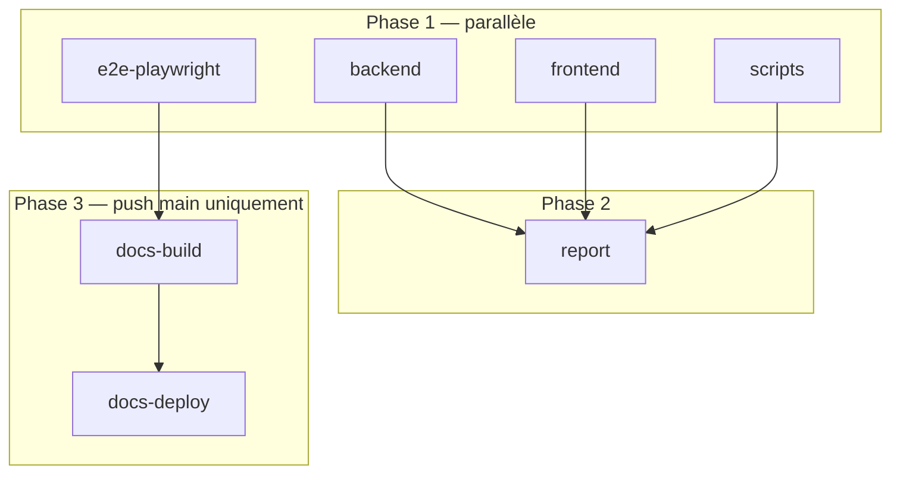

# Workflows GitHub Actions

**Runtime Node.js :** version **24** (fichier [`.nvmrc`](../../.nvmrc) — `setup-node` avec `node-version-file`, pas de variable Actions « fake »).

| Workflow | Déclencheur | Rôle |
|----------|-------------|------|
| [**CI**](ci.yml) | PR + push `main` / `develop`, `workflow_dispatch` | Lint, tests, coverage, Playwright, Codecov, wiki ; sur **push `main`** : GIF + Pages |
| [**Docs**](docs.yml) | `workflow_dispatch` uniquement | Regénération manuelle du site (option sans Playwright / sans IA) |
| [**CodeQL**](codeql.yml) | PR + push (chemins code) | Analyse sécurité statique |

## CI — cadre des jobs

Une seule stack Postgres + Nest + Nuxt + Playwright par run. Les GIF ne sont produits que sur **push `main`**.

### Phase 1 (parallèle)

| Job | Contenu |
|-----|---------|
| **backend** | Postgres, Prisma, lint, tests unitaires + e2e Jest (coverage) |
| **frontend** | `nuxt prepare`, lint, Vitest coverage |
| **scripts** | Vitest `scripts/docs` + `scripts/ci` |
| **e2e-playwright** | `run-playwright-stack.sh --skip-docker --all-projects` (smoke puis démo, une stack) ; sur **main** : `--gifs` |

### Phase 2

**report** — fusion coverage, Codecov (3 flags), wiki (push `main`).

### Phase 3 (push `main` seulement)

**docs-build** — télécharge `demo-gifs`, génération IA (Mistral), VitePress, OpenAPI, Histoire, assemblage `docs-site/`.

**docs-deploy** — GitHub Pages (aucun push Git sur le dépôt).

### Playwright (détail)

| Contexte | Projets | GIF |
|----------|---------|-----|
| PR, push `develop` | smoke + démo (desktop + mobile) | non |
| Push `main` | idem | oui → artefact pour **docs-build** |
| Local `npm run test:e2e:playwright` | smoke | non |
| Local `npm run test:e2e:demo` | démo | oui (ffmpeg) |

Script : [`scripts/ci/run-playwright-stack.sh`](../../scripts/ci/run-playwright-stack.sh) (`--all-projects`, `--gifs`).

## Docs (`docs.yml`)

Réservé au **lancement manuel** (Actions → Docs → Run workflow).

- `skip_playwright: true` — réutilise les GIF déjà dans `docs/public/demo/` (pas de stack).
- `skip_ai: true` — pas d’appels Mistral.

Le chemin normal après merge : tout passe par **CI** sur `main`.

## CodeQL

Toujours sur les PR (ruleset), même si seuls des fichiers markdown changent.

## Branche `main`

Ruleset **Protect main — PR obligatoire + CodeQL** — voir [protect-main.json](../rulesets/protect-main.json).
