# Guide d’utilisation — Open-Task

Captures animées générées par la CI (Playwright → GIF). Chemins : `assets/demo/desktop/` et `assets/demo/mobile/`.

> Les GIF sont générés par le workflow **Demo assets** (sur chaque PR vers `main` et sur `main`). En local : `npm run test:e2e:demo` (ffmpeg requis). Voir [`assets/demo/README.md`](../assets/demo/README.md).

---

## 1. Créer un compte

Inscription avec email, mot de passe et confirmations, puis redirection vers l’accueil.

| Desktop | Mobile |
|---------|--------|
| 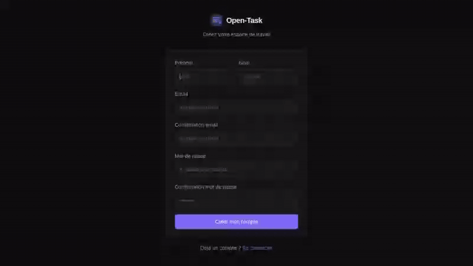 | 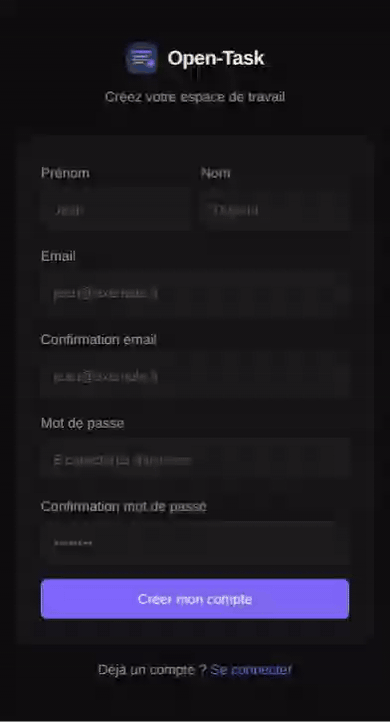 |

---

## 2. Listes et tâches

Créer une liste depuis la barre latérale, puis ajouter une tâche avec échéance.

| Desktop | Mobile |
|---------|--------|
| 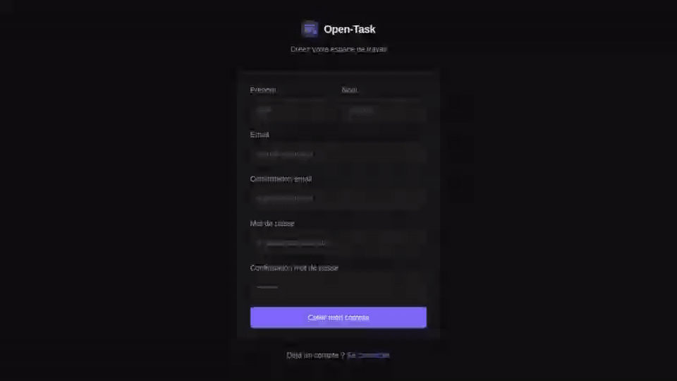 | 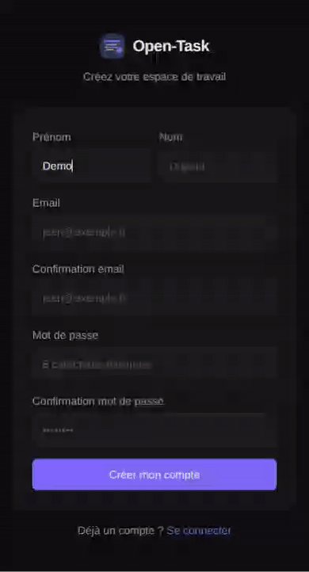 |

---

## 3. Vues Liste, Kanban et Calendrier

Basculer entre les trois modes d’affichage des tâches (boutons en haut de la zone principale).

| Desktop | Mobile |
|---------|--------|
| 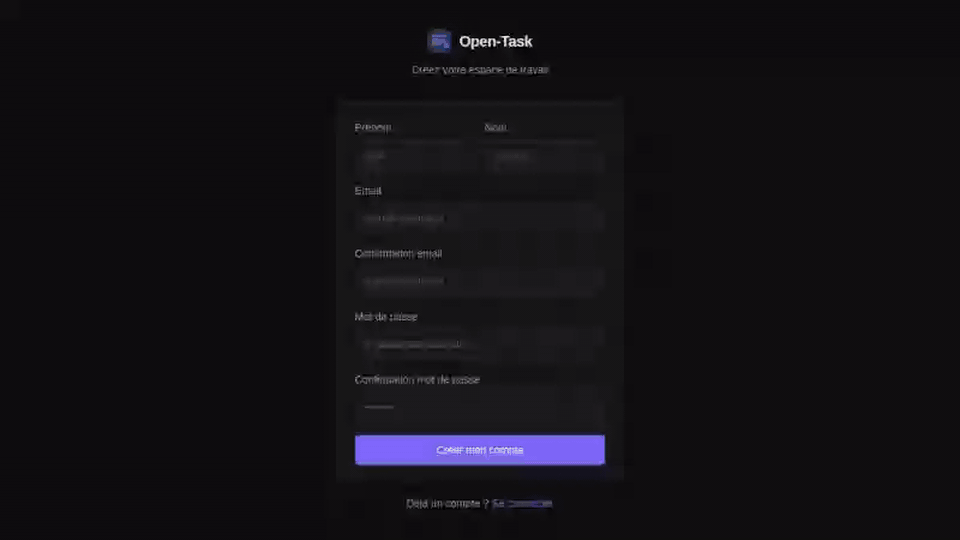 |  |

---

## 4. Connexion

Se déconnecter puis se reconnecter avec le même compte ; les listes restent disponibles.

| Desktop | Mobile |
|---------|--------|
| 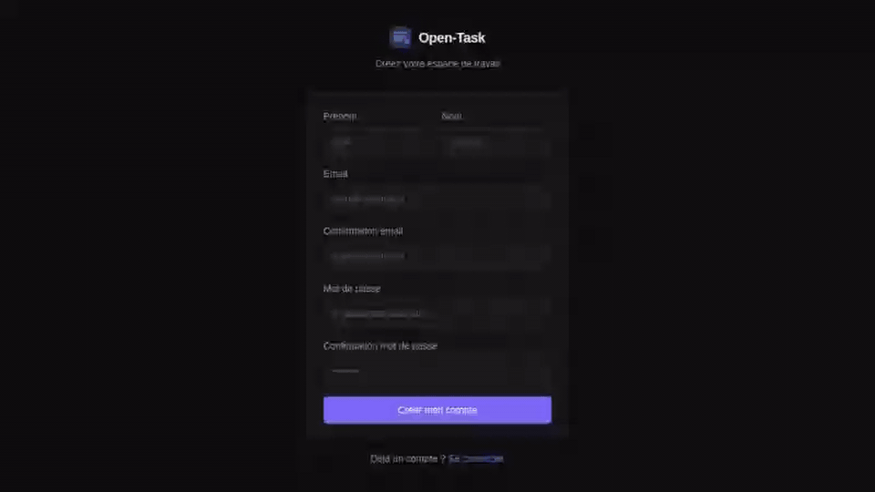 | 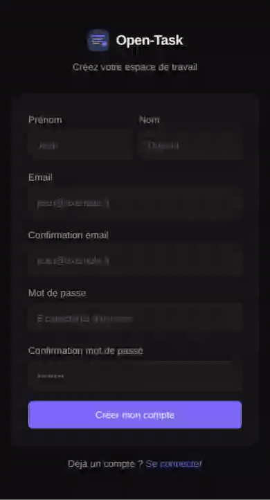 |

---

## 5. Navigation mobile

Sur petit écran : menu hamburger → tiroir des listes → création de liste et tâche.

| Mobile |
|--------|
| 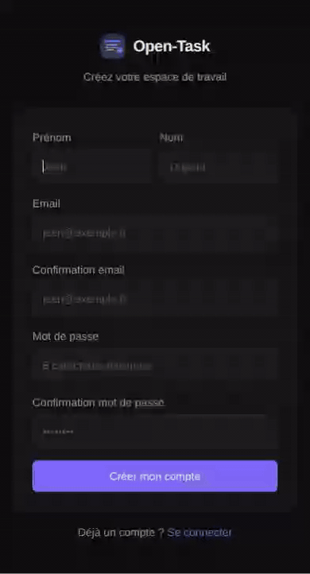 |

---

## 6. Thèmes

Changer de palette complète (aperçu dans la barre latérale → panneau de thèmes).

| Desktop | Mobile |
|---------|--------|
| 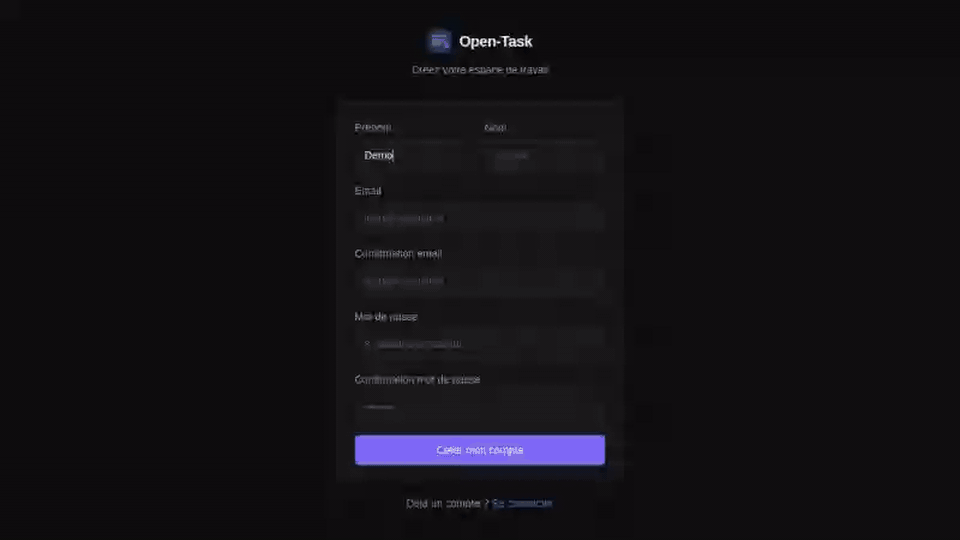 | 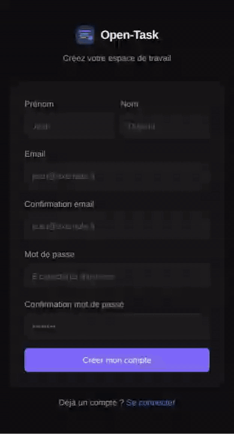 |

---

## 7. Kanban — glisser-déposer

Deux listes, une tâche déplacée d’une colonne à l’autre en vue Kanban.

| Desktop | Mobile |
|---------|--------|
| 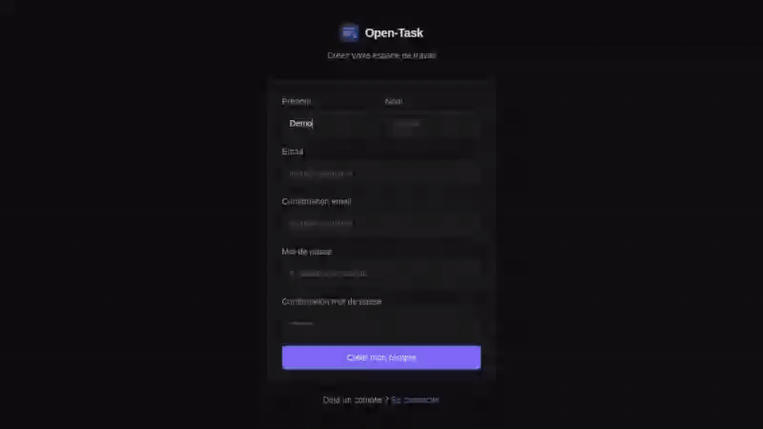 |  |

---

## 8. Calendrier — échelles

Vue calendrier : mois, semaine, jour et retour à « Aujourd’hui ».

| Desktop | Mobile |
|---------|--------|
|  |  |

---

## 9. Partage de liste

Un propriétaire invite un collègue par email ; le collaborateur voit la liste marquée « partagée ».

| Desktop | Mobile |
|---------|--------|
| 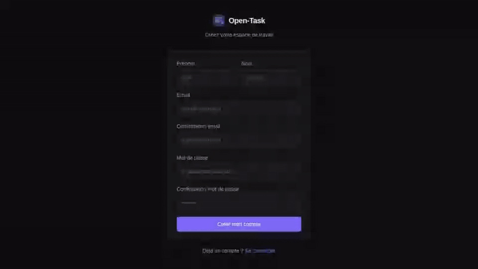 | 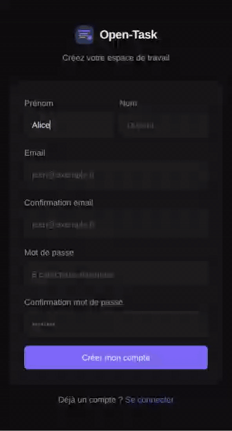 |

---

## Aller plus loin

- [Documentation technique](https://esteban-m.github.io/open-task/) (GitHub Pages)
- [README](../README.md) — installation Docker, API, WebSocket temps réel
- Rôles viewer / editor / admin : doc **Backend** et **Fonctionnalités** du README
