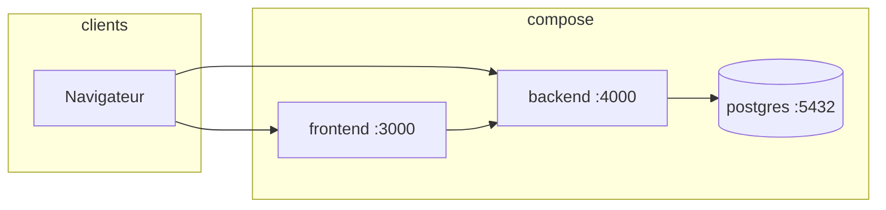

# Docker & services

Stack définie dans [`docker-compose.yml`](https://github.com/esteban-m/open-task/blob/main/docker-compose.yml).

## Services

| Service | Image / build | Rôle |
|---------|---------------|------|
| `postgres` | `postgres:16-alpine` | Persistance Prisma |
| `backend` | `backend/Dockerfile` | API NestJS + WebSocket |
| `frontend` | `frontend/Dockerfile` | Nuxt 3 (SSR désactivé en prod image) |

## Santé & dépendances

- PostgreSQL : healthcheck `pg_isready`
- Backend : attend Postgres healthy avant démarrage
- Frontend : dépend du backend

## Volumes

- `postgres_data` : données persistantes

## CI

Le workflow [`.github/workflows/ci.yml`](https://github.com/esteban-m/open-task/blob/main/.github/workflows/ci.yml) exécute lint, tests unitaires et e2e sur PostgreSQL 16 sans Docker Compose complet.

## Voir aussi

- [Démarrage rapide](/guide/getting-started)
- [Variables d'environnement](/reference/environment)
- [Architecture](/generated/architecture)
